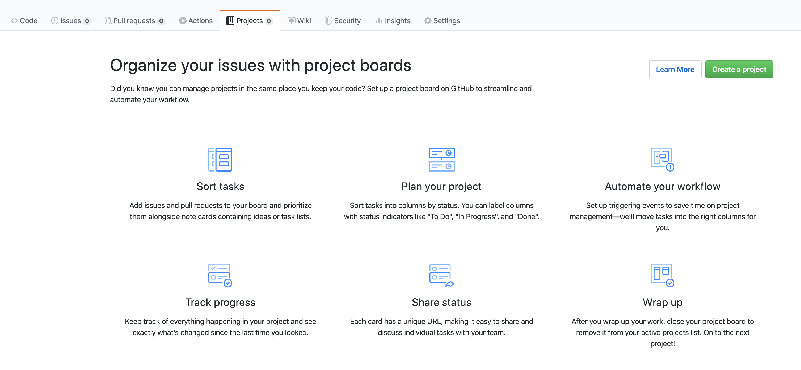

# GitHub

[GitHub](https://github.com/)brings together the world's largest community of developers to discover, share, and build better software.
The good thing is that you can use it for free if you create a non profit account.
GitHub nonprofit accounts are designed for official nonprofit organizations and charities that are nongovernment, nonacademic, noncommercial, nonpolitical in nature, and have no religious affiliation. Qualifying nonprofits are eligible for an Organization account with unlimited private repositories and unlimited users.

## Create your account

Follow the step describe on the [nonprofit page](https://github.com/nonprofit).

## Creating repos

Once connected, you will be able to create as many repos as you want. You can decide to make them public if you would like to make your code available or keep it private in case this is something more internal and do not want to share it externally. You can switch from private to public at any time and also manage it on a repo basis, simply go to the configuration of the repo. This is where you will be able to add team member per repo or global team member on the organization level.

## Managing project

GitHub allows the project management option too. Just select the project tab on your repo and then click on "create a project" as you can see bellow:

## Creating documentation

In the meantime, this is also possible to manage your documentation within your repo. If this is not done with MD files, you can also manage it by selecting the Wiki tab of your repo. I would not recommend managing your documentation like that, better to manage MD files within your repo and maybe use [gitbook tool](../README.md#Documentation) as described in the documenation part.
